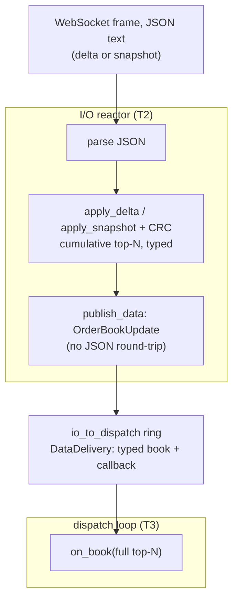
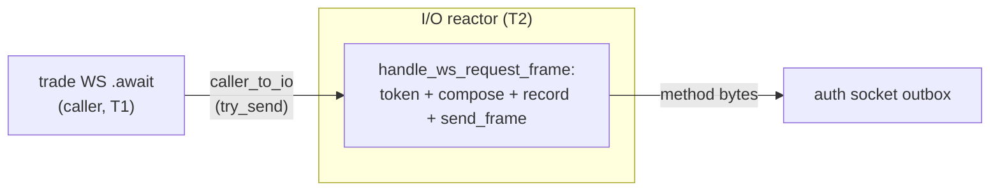

# Dispatch flow

Three Tokio tasks carry a book frame and a WebSocket order. Latency numbers: [dispatch-latency-bench.md](dispatch-latency-bench.md). Caller-facing model: [architecture.md](architecture.md). Internals: [development.md](development.md).

## Tasks

The I/O reactor is full-duplex: one `select!` loop, no wait on a slow consumer. Tasks are Tokio-spawned, not pinned OS threads.

| Task | Role | Caller-visible delivery |
|------|------|-------------------------|
| Caller (T1) | `try_send` onto `caller_to_io`, then `.await` | Order ack / result |
| Reactor (T2) | Sole reader and writer of every socket | — |
| Dispatch (T3) | Drain `io_to_dispatch`, invoke callbacks | `on_book` and other `on_*` |

The reactor writes a frame and returns to `select!`. Orders in flight are matched by `req_id`. Book frames continue while orders are outstanding. The same task reads and writes each socket. The only cross-task hop for book data is the `io_to_dispatch` ring.

- Order ack completes the caller's `.await` on T1.
- `on_book` runs on T3.

## Book delivery

Parse, maintain, and CRC run on T2. The callback runs on T3.

- The reactor holds the full book. `apply_snapshot` / `apply_delta` fold into the cumulative top-N and re-check CRC.
- A `Book` frame fans to `[Book, BookRaw]` only.
- `on_book` receives the full `OrderBookUpdate` (`Arc` clone onto the ring). `BookRaw` builds a small JSON envelope and decodes `BookDelta` in the handler.

## Order path

WS trade methods post a `WsRequestFrame` on `caller_to_io` and `.await` a oneshot. That hop does not enter the dispatch loop. REST (`.via(Transport::Rest)` / `prefer_rest_for_orders`) is HTTP.

On T1 the trading tracker is charged, then `try_send`. Full or closed rejects immediately (`TradeError::QueueFull` / not-open); the frame is not sent. T2 runs `handle_ws_request_frame`: cached token, `{method, params, req_id}`, record pending, `send_frame` (`try_send` on the auth outbox). A send error fails the pending.

The reply is matched by `req_id` on T2 and completes the oneshot. A blocked `on_*` callback cannot stall an order send (`blocking_data_callback_does_not_stall_order_send`).
